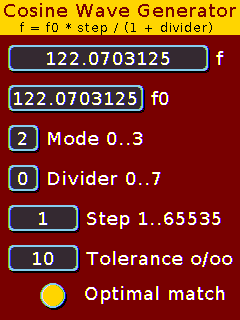
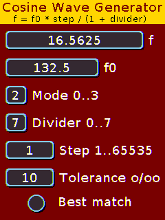
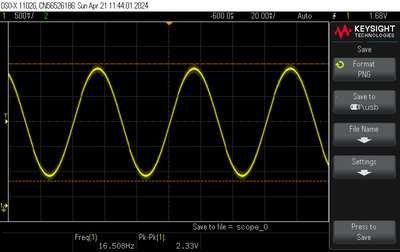
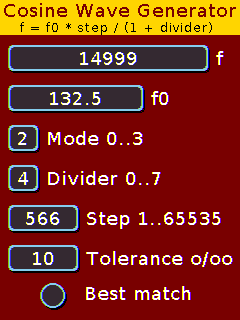
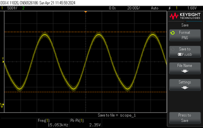

# CYD - A graphical user interface for the Cosine Wave Generator of the ESP32
I had the idea of using the **Cheap Yellow Display** CYD for a graphical user 
interface for the [**Cosine Wave Generator**](https://www.dodeka.ch/CosineWaveGenerator.html) 
that I programmed some time ago.

Because DAC_CHANNEL_1 is used for the photoresistor in the CYD, the settings 
only affect the second channel. When starting, the generator displays the 
reference frequency f0. If this deviates from the actual measured frequency, 
this can be corrected manually. I measured 132.5 Hz on my CYD and therefore 
set f0 accordingly.The theoretical frequency range is 15 .. 8'000'000 Hz, 
but only the audio range 15 .. 15'000 Hz is reasonably usable.

In the CYD, the output of DAC_CHANNEL_2 is connected to the input of the 
built-in amplifier. Because the wiring of this OpAmp is not optimal, I have
modified it as described [here](https://www.youtube.com/watch?app=desktop&v=6JCLHIXXVus) 
with the following resistor values: R7 = R8 = 18K, R9 = 33K 

Here are the settings and output signals for minimum and maximum audio frequencies 
measured at a speaker pin and to ground.
| Settings 16 Hz | Oscilloscope |
|:----------:|:-------------------------:|
|  |  |

| Settings 15 kHz | Oscilloscope |
|:----------:|:-------------------------:|
|  |  |
